I'm no graphic designer, but every time I need to do some basic image editing I 
go with GIMP. I always try to go with free software, even for the most 
meaningless tasks. GIMP may not be the most popular program, or even the best 
one, but it is free and you can do a lot with it. To illustrate this, I'll show 
you how to use GIMP to create stickers for Telegram and WhatsApp. The goal of 
this tutorial is to use create [this sticker](
../assets/images/my_gimp_sticker.webp) from a photo. Even if you are not 
interested in  stickers, you can still learn how to work with layers, remove 
the background from photos, and add smooth borders to any kind of shape.

<!--more-->

## Setup the canvas

To begin, create a new 512 x 512 pixels image with transparent background. Click
`File > New` in the menu bar and fill out the dialog form. Make sure you open 
advanced options and fill with transparency, otherwise you'll get a white 
background.  

[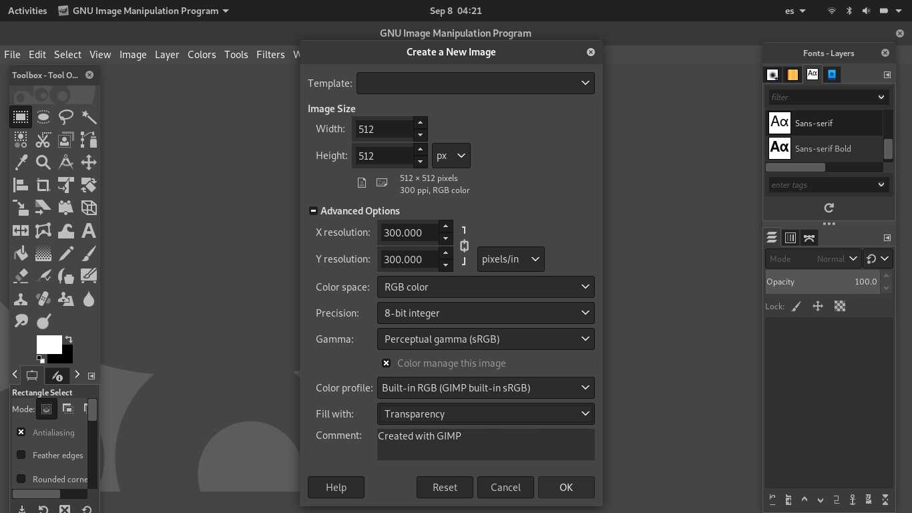](../assets/images/gimp_01.jpg)

Now that the canvas is ready it's time to open the image you want to use for 
your sticker. Click `File > Open` in the menu bar and select your file. You 
should have two windows like this:

[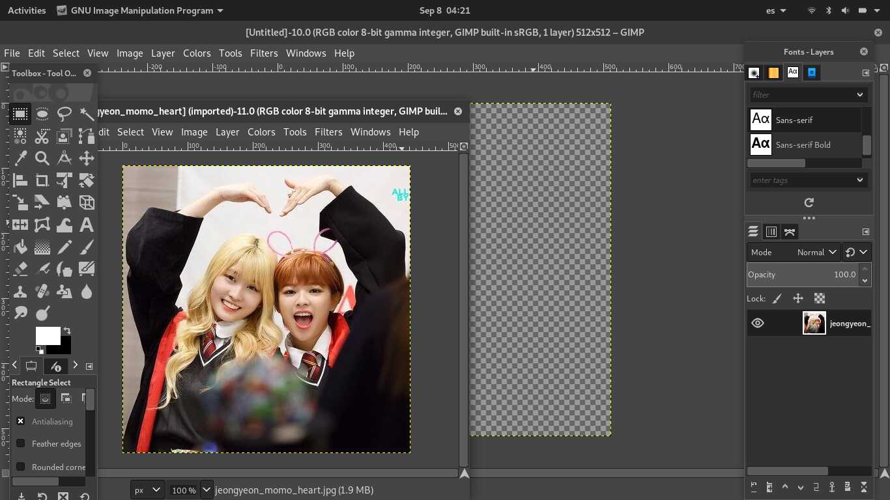](../assets/images/gimp_02.jpg)

Use the `Rectangle Select Tool (R)` to select the part of the image you are 
interested in (it doesn't have to be perfect tight), copy it, and paste it into 
the empty canvas. If it's bigger that the canvas you can use the `Scale Tool 
(Shift + S)` to shrink it. Since you pasted the image into the canvas, you 
probably have a floating selection layer with the pasted content in the layers 
window. This needs to be in a proper layer so right click it and click 
`To New Layer` in the context menu. If you don't have any floating layers, then
it probably already got created or merged with the background, so you can just 
skip to the next section.

[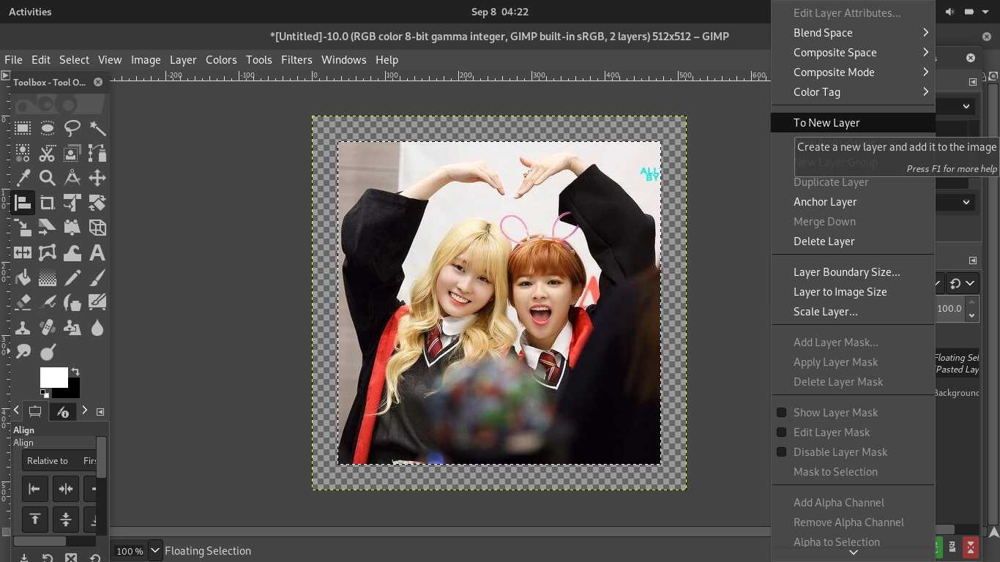](../assets/images/gimp_03.jpg)

## Remove the background

After the new layer is ready it's time to cut out the image with the desired 
shape and remove the background. This is the longest step, but it isn't really 
that hard. You just need a little patience. First, zoom in to at least 200% and 
use the `Free Select Tool (F)` to click on the points where you want to cut. 
You complete the selection by ending at the same point where you started it.

[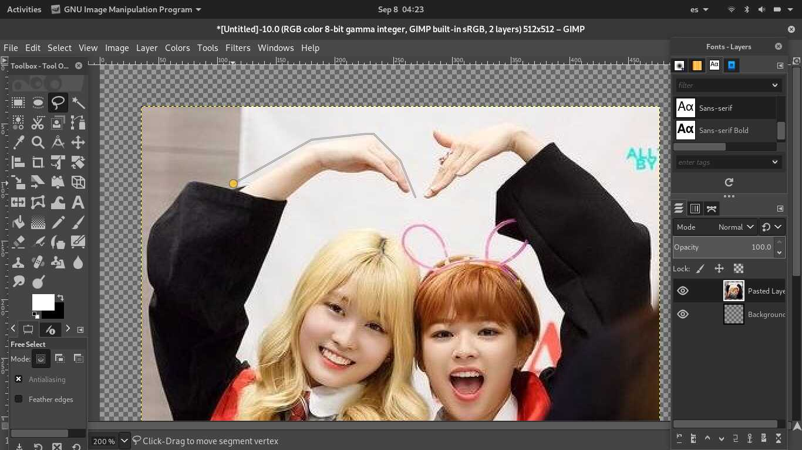](../assets/images/gimp_04.jpg)

Here you should strive for smooth shapes. It doesn't have to be perfect but 
avoid sharp corners or spikes. Also try to leave some space between the selection 
and the content that you want to be visible. The resulting selection looks like 
this:

[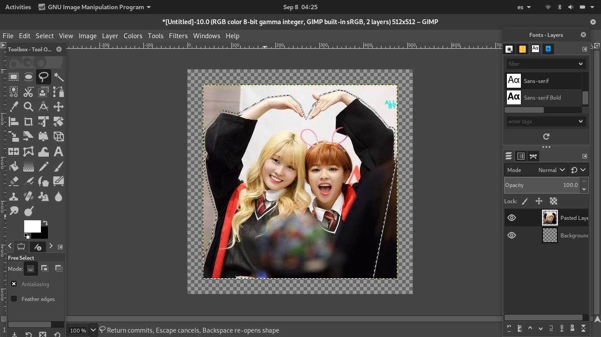](../assets/images/gimp_05.jpg)

After the selection is ready, it's easier to cut it out by just sending it to 
a new layer. You can create the new layer in the same way as you did after 
pasting and scaling. The only difference is that this time the selection 
isn't floating. To float it, right click inside the selection and then click 
`Select > Float` in the context menu.

[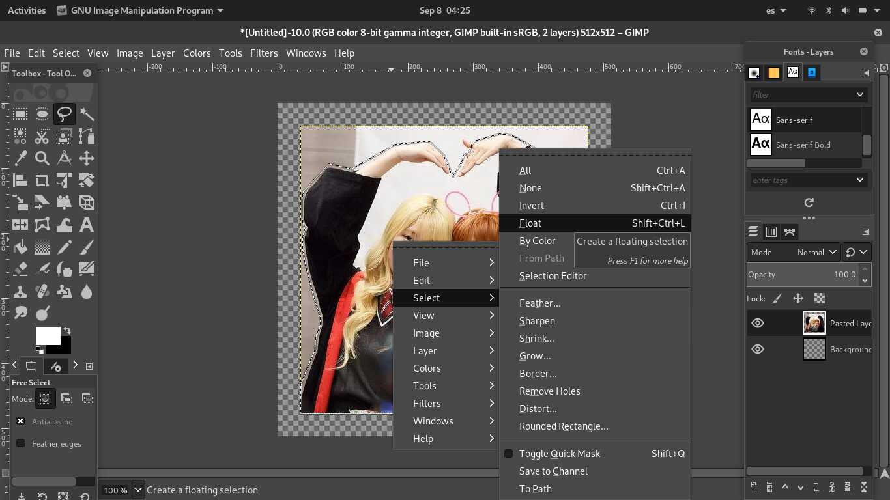](../assets/images/gimp_06.jpg)

Now that you have a floating layer with the actual sticker content, you can 
remove the background by deleting the underneath layer. In the layers window, 
right click it and then click `Delete Layer` in the context menu.

[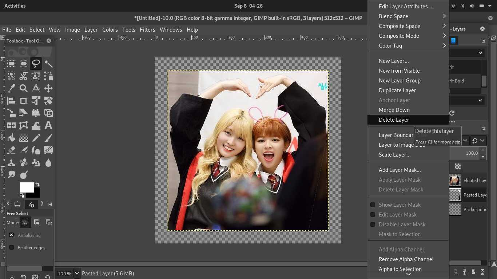](../assets/images/gimp_07.jpg)

Now that you finished cutting, you should only have one layer that covers the 
whole canvas and contains the sticker at the center. If you have more layers, 
merge them down. In the layers window, right click the top most layer and 
click `Merge Down`.

[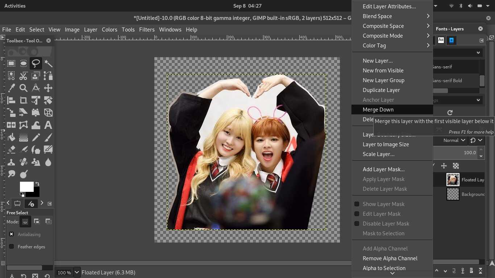](../assets/images/gimp_08.jpg)

## Add a border

The sticker is almost ready, but it's good practice to include a white border 
so that it is perfectly visible no matter what background is used in the 
messaging app. For this matter you must select the sticker's precise shape. 
The fastest way to do this is by using the `Fuzzy Select Tool (U)` to click 
anywhere in the transparent background and then inverting that selection by 
clicking `Select > Invert` in the menu bar.
  

Once you have the selection ready, create the border selection by clicking 
`Select > Border` in the menu bar and fill out the dialog form. I usually 
go with a border size of 4px.

[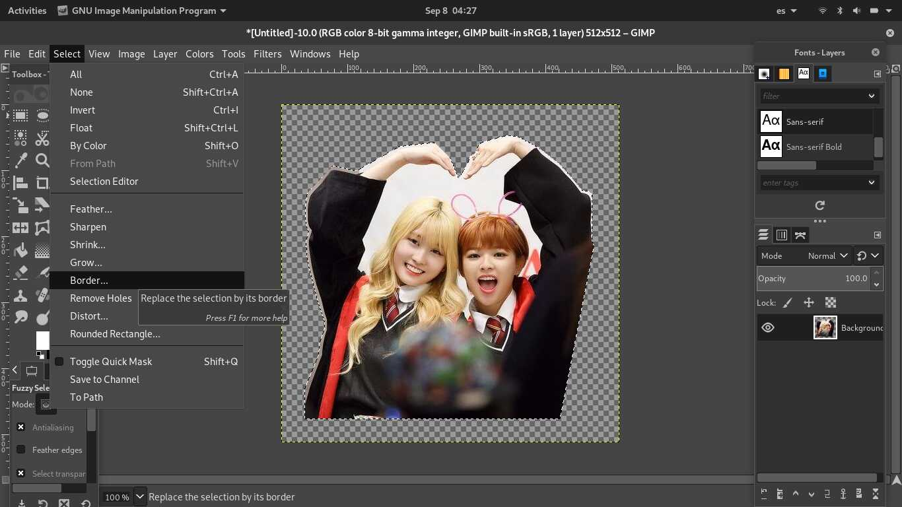](../assets/images/gimp_10.jpg)

The border is not created yet, there is only a selection for it. Before 
proceeding, you might want to make it smoother by applying a Gaussian Blur. 
To do this, click `Filters > Blur > Gaussian Blur` in the menu bar and fill 
out the dialog form. The only relevant values are `Size X` and `Size Y`. I 
usually go with a value of 4 for both, just like with the border size.

[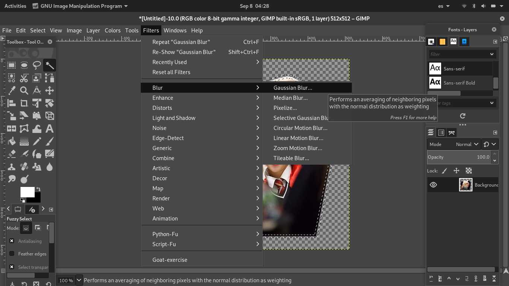](../assets/images/gimp_11.jpg)

[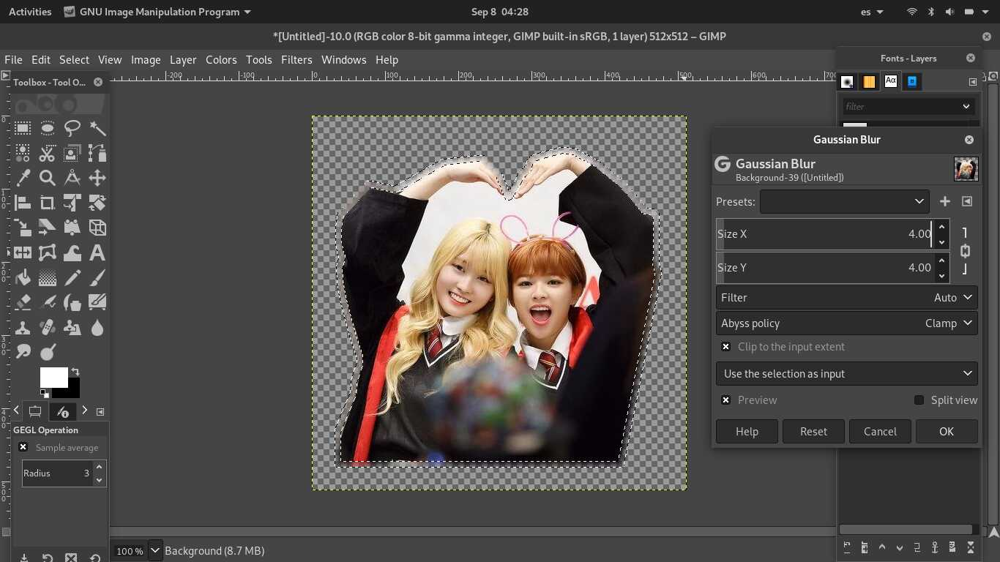](../assets/images/gimp_12.jpg)

Now that the border selection is ready, just use the `Bucket Fill Tool (Shift + 
B)` to paint it white, and that's it! You are ready to export.

[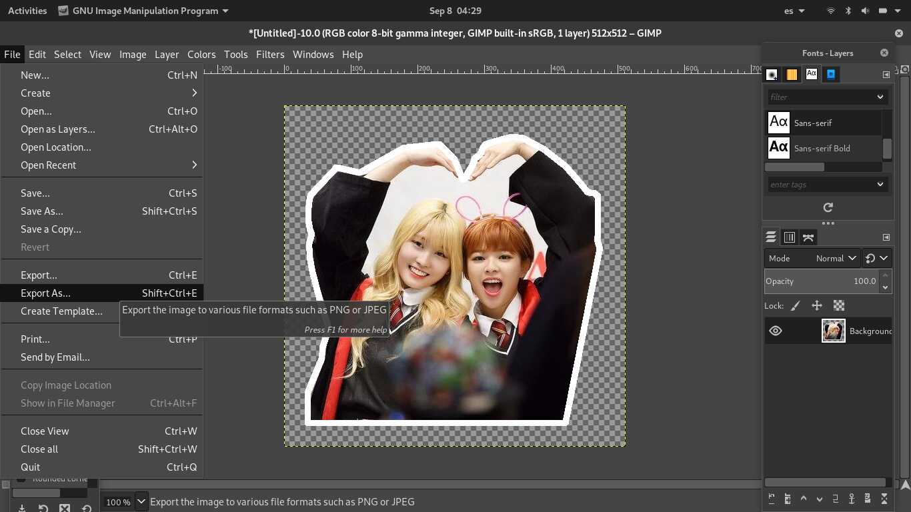](../assets/images/gimp_13.jpg)

## Export and distribute

It is recommended to export in the [WebP format](
https://developers.google.com/speed/webp), as it is the most efficient format 
for stickers, so choose that in the export dialog. Unfortunately, this isn't
supported everywhere yet, so you might want to export as PNG as well. If you 
keep the GIMP .xcf file, you can later export again in whatever formats you
may need. Now you are ready to upload your sticker to your platform of choice.

Uploading to Telegram is as easy as texting the [&#64;stickers](
https://telegram.me/stickers) bot and following its instructions. Once your pack 
is ready, users can download it from within the app. 

WhatsApp is more complicated as it requires you to build a whole app to 
distribute your stickers. The good news is that WhatsApp already provides 
[sample apps for third party stickers](https://github.com/WhatsApp/stickers) 
so you can just fork the repo and replace the sample sticker pack with your own.
