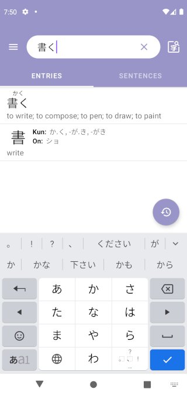
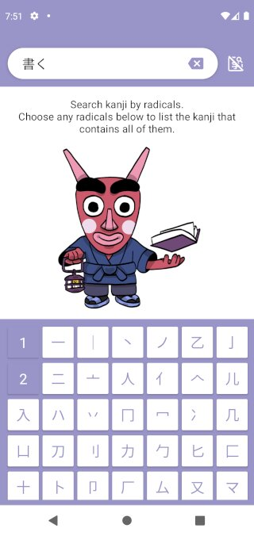

I'm happy to announce that I am releasing "OpenJisho", a Japanese dictionary 
Android app [in the Google Play store](
https://play.google.com/store/apps/details?id=com.gaumala.openjisho) today. 
As implied by the name is completely open source and you can get the source
code on [GitHub](https://github.com/GAumala/OpenJisho). If this sort of thing 
piques your curiosity, in this post I'll go into detail about this app and 
explain some of the technical decisions of the project.

<!--more-->

## What it does?

This app lets you type any word, in English or Japanese, and it will show you
any matching entries from well known dictionary files: [JMdict](
https://www.edrdg.org/jmdict/edict.html) and [KANJIDIC](
https://www.edrdg.org/wiki/index.php/KANJIDIC_Project). 

Additionally, there is 
a "Sentences" tab that will show you matching example sentences from the [Tatoeba 
project](https://tatoeba.org/en/). 

If you want to search entries or sentences
with a particular kanji, but you don't know how to type it in, there is a
feature that lets you search it by radicals using [RADKFILE](
https://www.edrdg.org/krad/kradinf.html). 

All queries work 
offline because dictionary files are downloaded during the first time setup and 
stored in a SQLite database. An internet connection is only required during the 
setup.

## Technical details

The rest of this post is aimed at Android developers, so you can stop reading if 
this isn't you. 

This codebase reflects pretty much all my opinions about Android 
development. I started this project two years ago, so it doesn't have all the 
newest tools like Compose or Navigation. I avoid adding libraries unless I really 
need them. Most of the time I try to use what the Android platform already has or 
I try to implement it myself, unless it's not worth the effort. For example I 
use `HTTPUrlConnection` for downloads and `JSONObject` for JSON 
serializing/deserializing. I don't use dependency injection frameworks either. 
I think they are too complex. Dependency injection is important though. I just
do it manually, creating objects as they are needed in factory classes.

The App architecture is MVI. I use my own implementation, [which I've already 
written about in the past](
./2019-04-30-writing-mvi-apps-in-android.html), so I won't talk too much 
about it here. It is designed as a single activity application. Every screen
is implemented as a `Fragment` class. I transition between fragments manually 
using fragment transactions, [as described in this previous post](
./2020-05-03-navigating-with-fragments.html). Most transitions use a simple
"slide" animation implemented in XML. Some of them, like the one used for search 
by radicals, use the [Transitions API](
https://developer.android.com/training/transitions), which looks really cool.
All transition animations are implemented in the `MainTransitions` class, in case
you want to check them out.  

A funny thing about animations in this app, is that I added second activity 
only because I wanted to use the default animation that Android uses for 
activities. I really liked the default animation that android uses when it
launches a new activity on my Oreo phone, so I tried implementing it for 
fragment transitions. Unfortunately, it was not possible. I don't remember 
the exact reason, but I think it was because it was implemented in a private 
XML file in the Oreo source code, which made it unavailable on older Android 
versions. So for things like entry details, I launch a secondary activity 
to display the next fragment just for the free animated transition. I may 
end up removing this later on. Having a single activity makes things a lot 
simpler.

For the SQLite database I use [Room](
https://developer.android.com/training/data-storage/room/). There is a lot I 
could write about Room and how I use it for dictionary queries, but it would 
probably be long enough to warrant its own post. Overall I'm really happy 
with it, specially with the support for full-text search, which helps a lot 
when searching for sentences. The only problem that I have is that there is 
no easy way to rank full-text search results by relevance. For dictionary 
entries, I do try to move exact matches to the top of the list, but I use 
pagination to display the results list. If the best result is not on the first 
page, there's nothing I can do about it. *If only the mega corporation behind 
Room had some experience with search engines...*

The first time setup that populates the the SQLite database is another very
large topic that could have its own post. It has to download a few files, 
parse them, and store the parsed data into the database in a way that is 
properly indexed. This is done concurrently using [coroutines](
https://kotlinlang.org/docs/coroutines-overview.html). It's really good. I 
can't imagine doing this before coroutines got released. I use [channels]( 
https://kotlinlang.org/docs/channels.html) to allow concurrent tasks to 
report progress at every step. Then, the UI thread can pick one task and
display its current progress to the user. When that task completes, another 
one gets picked, and so on until all tasks complete. 

It can take a couple of minutes to finish all the setup tasks. The longer time 
this goes on, the more likely unexpected failures can occur. One of the measures 
I've taken is to use a [foreground service](
https://developer.android.com/guide/components/foreground-services) to avoid 
getting killed by the OS when it needs to reclaim some memory. However, even 
with that, there's still plenty of work needed to make it robust, like 
implementing checkpoints to avoid retrying tasks that already completed or 
sending the appropriate HTTP headers to resume downloads. 

If you are interested the whole setup, you can check out the `SetupWorker` 
class. This is probably the most mission critical class of the app so I added 
plenty of unit tests to ensure that it works correctly and that it's able to 
handle unexpected errors.

I could go on all day talking about the implementation details of this app,
but I think I should wrap it up here. If you are interested in working with
the codebase but have questions, feel free to open an issue on GitHub and 
I'll try to help. I do hope to get a few collaborators for maintenance and 
new features.
