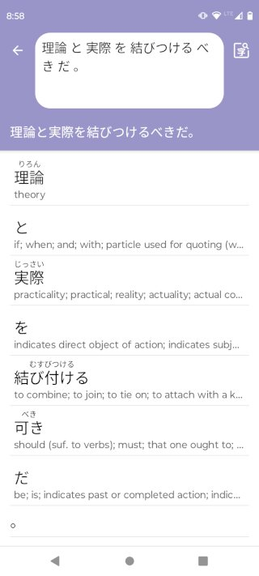
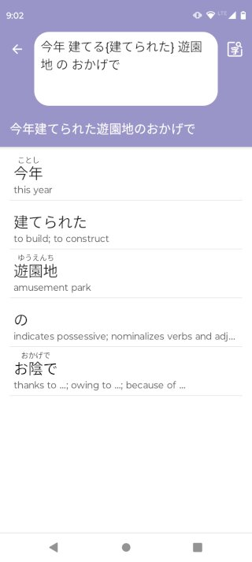
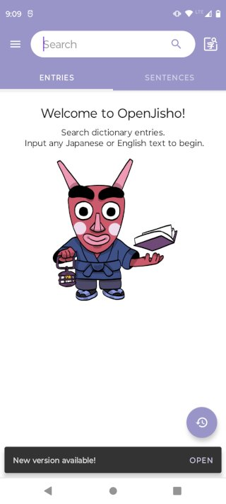

It's been almost three years since the [first release of OpenJisho](
/posts/2021-12-06-announcing-openjisho.html). There hasn't been much activity
in the repository between 2022 and 2023, but I've been working hard this week
updating dependencies and configuration files in order to add new features. I'm
happy to announce a new version today with some significant changes. 

<!--more-->

### New feature: Input Sentence

There's a new screen that lets you input a body of text and output a list
of JMdict entries for every word found. You can access this screen from
the main menu. 

The UI is meant to be as similar as possible to the example sentences
shown in the main screen. The app doesn't have yet an algorithm
for accurately splitting sentences into Japanese words, so you have to 
separate words with spaces (' ') for this to work. 

Real world text usually has verbs conjugated in forms that are not listed
in the dictionary. If you'd like to look for the correct entry, but preserve
the original conjugation in your sentence you can use [Tatoeba indices syntax](
http://edrdg.org/wiki/index.php/Sentence-Dictionary_Linking). Here is an 
example:

Notice how this sentence uses "建てられた" but we want to lookup "建てる"
instead. By using the curly braces ("{}") we can tell the parser to lookup
the previous word, but to display the one inside the braces. This is helpful
in more complex bodies of text, when you need to constantly reread the whole
thing to understand it without losing any context.

### New Releases on GitHub

Starting with this version, OpenJisho releases are now going to be on GitHub
instead of Google Play. You can use [this website](
https://gaumala.github.io/OpenJisho/) to download the latest version.

The reason for this change is that my Google Play account along with the 
OpenJisho listing has been removed. I don't know why Google did this, but 
inactivity was probably one of the reasons. I don't like using Google products,
so I created a Google account specifically for publishing this app and never
logged in again. If I do it again, it will most certainly end the same way,
so I think GitHub is the better choice for this.

Google Play was convenient for pushing new versions to users. Since I can't use
it anymore, I've also added a notification in the main screen whenever a new
version available. The app now checks what the latest released version is using
a single HTTP request to the GitHub pages site. It looks like this:

