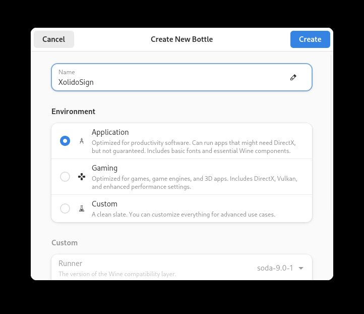
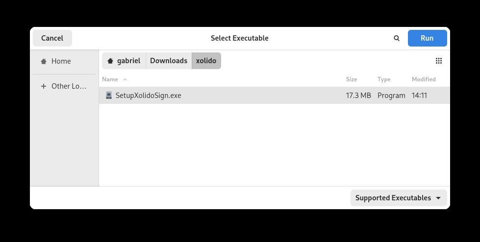
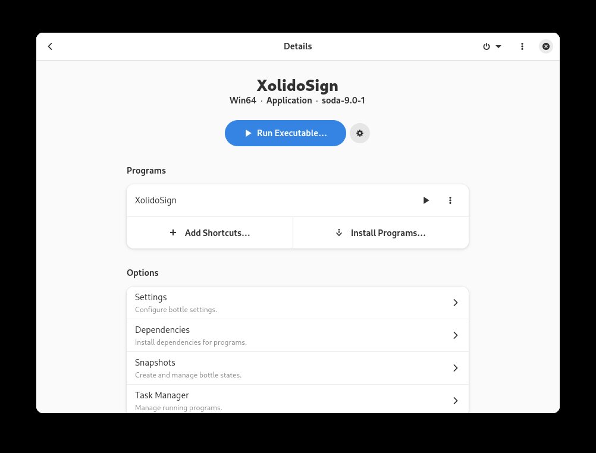
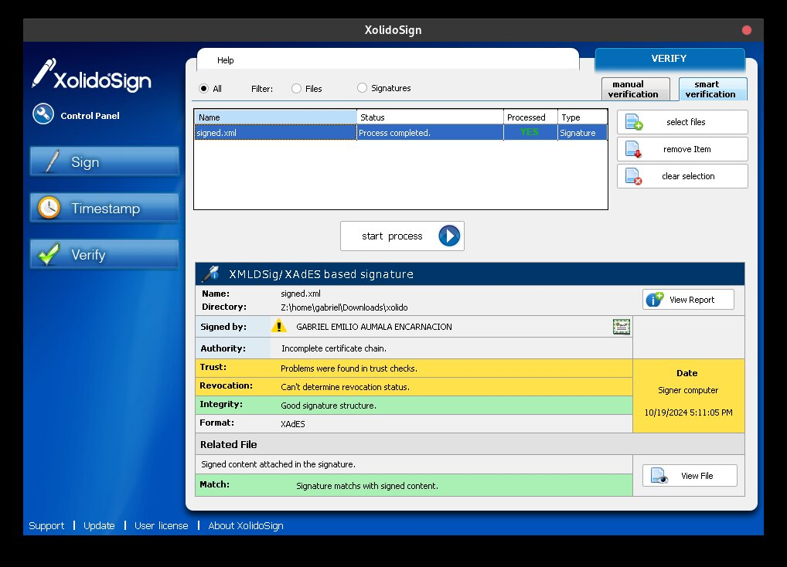

[XolidoSign Desktop](https://www.xolido.com/lang/xolidosign/xolidosigndesktop/)
es el programa recomendado por el SRI para el debug de problemas
de firma en comprobantes electrónicos. Es exclusivo para Windows, pero es
posible correrlo en Linux con WINE. Podemos también usar [Bottles](
https://usebottles.com/) para instalar los .dll necesarios a través de una
interfaz gráfica y correr WINE en un sandbox con mayor seguridad. Esta es
una guía para instalar XolidoSign con Bottles y verificar firmas electrónicas
en Linux.

<!--more-->

## Instalación de Bottles

Vamos a instalar Bottles solo para el usuario activo, por lo cual es necesario
tener el respositorio "flathub" agregado para el usuario.

```
flatpak remote-add --if-not-exists --user flathub https://dl.flathub.org/repo/flathub.flatpakrepo
``` 

Despues de eso se puede instalar Bottles con:

```
flatpak install --user flathub com.usebottles.bottles
```

Flatpak instala Bottles sin permisos para accedera los archivos del 
usuario. Esto es bueno porque no podemos confiar en programas para Windows
descargados de internet. Sin embargo, es necesario habilitar por lo menos 
1 directorio para colocar el instalador de XolidoSign y los archivos firmados 
que queremos validar. 

En mi caso yo descargué el instalador de XolidoSign en el directorio
`/home/gabriel/Downloads/xolido`, así voy a darle permiso a Bottles de leer
archivos en ese mismo directorio:

```
flatpak override --user com.usebottles.bottles --filesystem="/home/gabriel/Downloads/xolido:ro"
```

El "ro" al final es para "read-only" (sólo lectura). Para más información puedes
consultar [la documentación de flatpak para permisos de acceso al sistema de
archivos.](https://docs.flatpak.org/en/latest/sandbox-permissions.html#filesystem-access)

## Instalación de XolidoSign

Para empezar hay que correr Bottles con:

```
flatpak run --user com.usebottles.bottles
```

Después de que la interfaz gráfica realiza su setup, es necesario crear un 
botttle para XolidoSign con ambiente "Application".

[](
../assets/images/bottles_xolido_01.jpg)

Al terminar vas a ver la pantalla de detalles del bottle "XolidoSign":

[](
../assets/images/bottles_xolido_02.jpg)

Lo primero que hay que hacer aquí es dar click al botón "Dependencies" e
instalar las siguientes dependencias:

- `dotnet35` 
- `vcredist6sp6`

Finalmente instalamos XolidoSign dando click al botón azul 
"Run Executable..." y seleccionando el archivo 
`/home/gabriel/Downloads/xolido/SetupXolidoSign.exe`.

[](
../assets/images/bottles_xolido_03.jpg)

Después de la instalación, la pantalla de detalles se va a ver así:

[](
../assets/images/bottles_xolido_04.jpg)

La sección "Programs" ahora tiene una nueva fila "XolidoSign" con
un botón play (⏵) para ejecutar el programa.

Si agrego un archivo `signed.xml` al directorio 
`/home/gabriel/Downloads/xolido/`, Lo puedo cargar en el programa y validar 
la firma.

[](
../assets/images/bottles_xolido_05.jpg)
