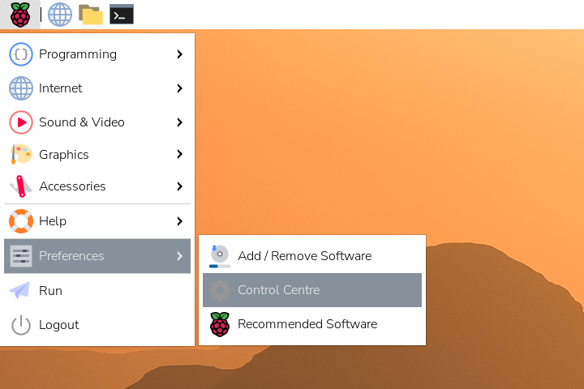
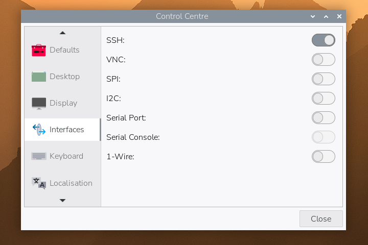
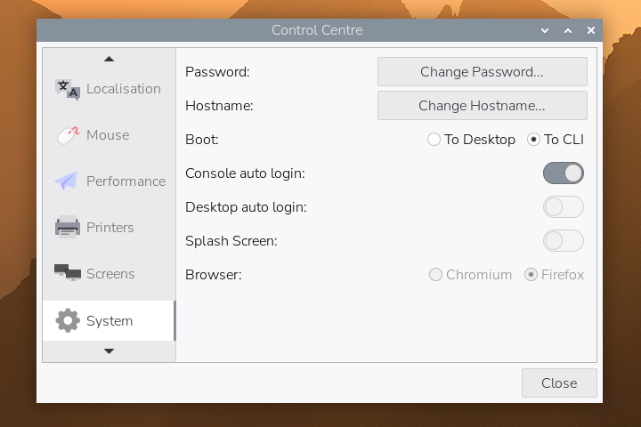
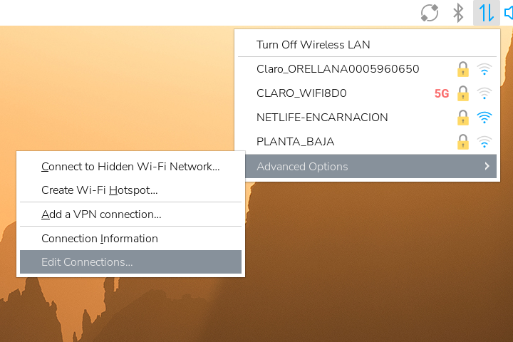
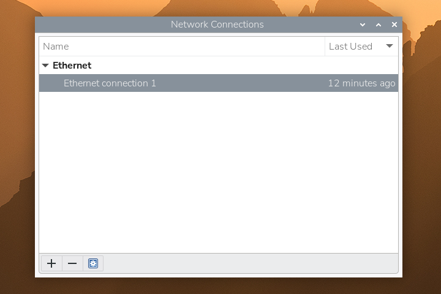

After running [Jellyfin](https://jellyfin.org/) on my desktop PC for a while, I decided to move it to a
Raspberry Pi 4 for 24/7 availability. This guide walks through the complete
setup process I settled on after some trial and error—from flashing the SD card
with Raspberry Pi OS to configuring external storage, running Jellyfin in Docker, and even
adding [Transmission](https://transmissionbt.com/) for torrent downloads. Along the way, I'll share the
workarounds I discovered for common issues and the media management approach that
works best for keeping everything organized.

<!--more-->

## Why Jellyfin

Aren't you fed up with streaming services? I know I am. [Streaming fatigue](
https://www.economicsonline.co.uk/all/streaming-fatigue-and-the-fragmentation-of-digital-entertainment.html/
) is totally a thing these days. In the past months, after successfully
deploying a few web apps I started wondering if I could run my own media server
at home. This is where I discovered Jellyfin, and you definitely don't need to 
be a seasoned engineer to run it. I can guarantee it lives up
to its popularity—the official clients have beautiful UIs and cover all major
platforms. The community keeps releasing third-party clients that scratch whatever
itches the official clients couldn't reach. My personal favorite is
[Symfonium](https://symfonium.app/), an Android music player that can integrate your
Jellyfin library as well as other platforms like Plex, Kodi, and more.

I got it running on my desktop PC first, it was very easy to install and it worked great.
I cannot emphasize how cool it is to have your own streaming platform curated to your 
personal tastes. The only downside was having to walk into my bedroom to turn on the PC
when I just wanted to lay on the couch and watch something on the living room TV. To 
keep Jellyfin available around the clock, I repurposed an old 
 Raspberry Pi 4 and paired it with a 4TB HDD in a USB enclosure for storage.

Using a Raspberry Pi as a server instead of a conventional PC isn't as straightforward though.
I flashed the Pi's SD card three times until I finally got the definitive setup, so I decided to
write this guide for future reference.

## System requirements

- A Raspberry Pi that can run a 64-bit OS (Pi 4 recommended; Pi 3B+ also works) with at least 2 GB of RAM.
- Reliable cooling such as a heatsink and fan—the board will be on 24/7.
- 32 GB (or larger) microSD card for Raspberry Pi OS; the OS, caches, and packages need the extra space to avoid premature wear.
- USB HDD in a powered enclosure (4 TB in this build). SSDs can run bus-powered, but make sure your enclosure or adapter is reliable.
- Wired network connection (strongly recommended).

## SD card setup

Start by visiting [raspberrypi.com](https://www.raspberrypi.com/software/)
and downloading **Raspberry Pi OS (64-bit)**. [Jellyfin 10.11.0](
https://jellyfin.org/posts/jellyfin-release-10.11.0/), dropped support for 
32-bit ARM systems so make sure you grab the 64-bit build even if your Pi 
has been running a 32-bit OS. The download should give you a 
`raspios-trixie-arm64.img.xz` image. Once you have the file, verify its 
checksum, decompress it, and flash the microSD card:

``` shell
# Flash Raspberry Pi OS 64-bit to SD card
unxz raspios-trixie-arm64.img.xz
sudo dd if=raspios-trixie-arm64.img of=/dev/sdb bs=4M status=progress
```

Be sure to replace `/dev/sdb` with the correct device path for your SD card.
When the `dd` command finishes, safely eject the card and insert it into the
Raspberry Pi.

## OS setup

Power on the Raspberry Pi and complete the Raspberry Pi OS first-run wizard.
Once you reach the desktop, click the Raspberry menu in the top-left corner,
head to **Preferences → Control Centre**, and open it as shown below:



In **Interfaces**, toggle SSH on as shown below—this is how you'll manage the
server remotely:



Next, open the **System** section and set the boot target to CLI. The server
doesn’t need the desktop environment, so booting straight to the console keeps
things lightweight:



Close Control Centre, click the network icon in the panel, and choose **Advanced
Options → Edit Connections…** as shown here:



In the **Network Connections** window, remove any existing profiles and create a
new Ethernet connection—wired networking offers better reliability for a home
server:



When the **Editing Ethernet connection** window opens, switch to the **IPv4
Settings** tab, set the method to `Manual`, and enter an address that is unused
on your network. My gateway is `192.168.100.1`, so I reserved `192.168.100.32`
for the Raspberry Pi after checking availability; use whatever tool you trust to verify
the IP you pick is free. Save the changes—you should now see the new static profile in the list.

With networking configured and SSH enabled, reboot the Pi to a TTY. Before
moving on to the next section, take a moment to install your preferred CLI tools
and dotfiles (shell, text editors, etc.), since you’ll spend most of your time managing
the server over SSH.

From this point forward I’ll refer to the account created during the Raspberry
Pi OS setup wizard as `pi`; feel free to substitute your actual username in the
commands that follow.

Because the Pi now has a fixed address, you can simplify connections from other
machines by adding an entry like `raspberry.local 192.168.100.32` to their
`/etc/hosts`. 

## Mount external storage

Connect the 4TB HDD (in its USB enclosure) to the Raspberry Pi. The drive must
be formatted as `ext4` before mounting. If it is a new drive, format and mount
it under somewhere like `/mnt/`, then adjust ownership so the `pi` user can 
manage the files:

``` shell
# Format drive as ext4 (if new)
sudo mkfs.ext4 /dev/sda1

# Mount and set ownership
sudo mkdir -p /mnt/hdd0
sudo mount /dev/sda1 /mnt/hdd0
sudo chown -R pi:pi /mnt/hdd0
```

Add an entry to `/etc/fstab` so the drive mounts automatically on boot. Use the
drive's PARTUUID for reliability:

``` shell
sudo blkid /dev/sda1
# Copy the UUID output and add something like the following to /etc/fstab:
PARTUUID=YOUR-UUID-HERE  /mnt/hdd0  ext4  defaults,noatime  0  2
```

In my case I mounted it to `/mnt/hdd0` so that if ever decide to add more hard
drives I can just call them `hdd1`, `hdd2`, and so on. I plan on using this
hard drive for more things than just Jellyfin, so the actual media libraries will
be stored under `/mnt/hdd0/media/`.


After updating `fstab`, run `sudo mount -a` to verify the entry works. Even with
`fstab` configured correctly, you might notice the drive failing to mount after
a reboot. Cheap USB enclosures sometimes back-feed power on the 5V line, so the
Pi never fully resets and the disk wakes up in a “half on” state. Always use a
drive enclosure with its own power adapter (the Pi can’t supply enough current),
and prioritize high-quality, USB-compliant models—many include physical power
switches that let you cycle the disk if the board hangs. If you encounter this
back-powering quirk, unplug and reconnect the drive or plan an upgrade to
hardware that doesn’t keep the board partially powered during shutdown.

## Run Jellyfin with Docker

Install Docker using the official convenience script:

``` shell
curl -sSL https://get.docker.com | sh
```

Create directories to persist Jellyfin's configuration and cache data:

``` shell
# Create directories
mkdir -p /home/pi/services/jellyfin/{config,cache}
```

Pull the Jellyfin container image and start it. The `pi` user that you created 
during initial setup typically has UID and GID 1000, but confirm with `id pi`
before running the container:

``` shell
docker pull jellyfin/jellyfin

docker run -d \
  --name jellyfin \
  --user 1000:1000 \
  --net=host \
  --volume /home/pi/services/jellyfin/config:/config \
  --volume /home/pi/services/jellyfin/cache:/cache \
  --mount type=bind,source=/mnt/hdd0/media,target=/media \
  --restart=unless-stopped \
  jellyfin/jellyfin
```

The container binds to the host network, so Jellyfin will be available at
`http://<raspberry-pi-ip>:8096`. Complete the Jellyfin web setup wizard to add
your media libraries and create an admin account. With the drive mounted and
Docker configured, the Raspberry Pi is now ready to serve your media collection.

## Bonus: Install Transmission

With Jellyfin running, you can add a lightweight torrent client that downloads
straight to the media drive. Transmission exposes a web UI and fits well in a
headless workflow.

Install the daemon:

``` shell
sudo apt install -y transmission-daemon
```

By default the daemon runs as `debian-transmission`. Switch it to your `pi`
account so file ownership aligns with the rest of the media library:

``` shell
sudo systemctl edit transmission-daemon.service
```

Add the following override:

```
[Service]
User=pi
```

Save and exit, then reload the unit file and stop the daemon before editing its
configuration:

``` shell
sudo systemctl daemon-reload
sudo systemctl stop transmission-daemon
```

Because the service now runs as `pi`, Transmission keeps its configuration in
`~/.config/transmission-daemon/settings.json`. Open it with your editor of choice
and update the download paths as follows:

``` json
{
    "download-dir": "/mnt/hdd0/seeding",
    "incomplete-dir": "/mnt/hdd0/incomplete",
    "incomplete-dir-enabled": true,
    "umask": 2,
    "rpc-whitelist": "127.0.0.1,192.168.100.*",
    "rpc-host-whitelist-enabled": false
    // ... leave the rest of the settings as they are ...
}
```

Here’s what each of those keys does:

- `download-dir`: where completed torrents land (`/mnt/hdd0/seeding`).
- `incomplete-dir` and `incomplete-dir-enabled`: keep partial downloads in `/mnt/hdd0/incomplete`.
- `umask`: using `2` (octal `002`) creates files/directories that are group-writable.
- `rpc-whitelist`: allows RPC access from localhost and `192.168.100.*`; change this to match your subnet. You may also need to add docker container ip addresses here if you want future containers to access transmission.
- `rpc-host-whitelist-enabled`: set to `false` so you can visit the web UI using any hostname that resolves to the Pi.

If you want to tweak additional options, the Transmission project keeps an
excellent reference on editing configuration files [[source]](
  https://github.com/transmission/transmission/blob/main/docs/Editing-Configuration-Files.md).

Create the directories and restart the daemon:

``` shell
sudo mkdir -p /mnt/hdd0/{seeding,incomplete}
sudo systemctl start transmission-daemon
```

Open `http://<raspberry-pi-ip>:9091` to access the Transmission web interface.
Add torrents there and they'll download directly into the media hard drive.

For torrent discovery I also rely on [Jackett](https://github.com/linuxserver/docker-jackett),
which aggregates multiple trackers behind a single search UI. You can run it alongside
Transmission with a simple `docker run` invocation from the project's Docker Hub page.

## Managing your media library

Whether you torrent your media or rip your own discs, you need to organize your
files properly. Jellyfin expects a specific file structure, so you need to be
meticulous about your directory organization—no dumping files haphazardly into
the media library. What I do with Transmission is
that I let `download-dir` keep whatever naming the tracker provides and then I
 curate Jellyfin's folders with hard links so seeding continues untouched. 
 Because `/mnt/hdd0` is a single ext4 filesystem, it's possible to use `ln` 
 to create links without duplicating data. For example:

``` shell
mkdir -p "/mnt/hdd0/media/movies/Some Film (2025)"
ln "/mnt/hdd0/seeding/Some.Film.2025.WebRip.1080p/Some.Film.2025.mkv" \
   "/mnt/hdd0/media/movies/Some Film (2025)/Some Film (2025).mkv"
```

Feel free to script this process or use media managers; the key is to keep 
the original files in place while presenting Jellyfin with cleanly named 
directories. Here’s a small helper I use to reorganize music while leaving the
original torrent folder untouched:

``` bash
#!/bin/bash

# Usage: ./organize_artist_music.sh "Artist Name"
SEED_DIR="/mnt/hdd0/seeding"
MUSIC_DIR="/mnt/hdd0/media/music"

if [ -z "$1" ]; then
  echo "Error: Please specify an artist name."
  echo "Usage: $0 \"Artist Name\""
  exit 1
fi

ARTIST="$1"
ARTIST_DIR="$MUSIC_DIR/$ARTIST"

# Create artist directory with correct permissions
mkdir -p "$ARTIST_DIR"

# Process each album by this artist
find "$SEED_DIR" -mindepth 1 -maxdepth 1 -type d -name "$ARTIST -*" | while read -r album_path; do
    # Extract album name (remove "Artist - " prefix)
  album_name=$(basename "$album_path" | sed "s/^$ARTIST - //")

  # Create album directory
  album_dir="$ARTIST_DIR/$album_name"
  mkdir -p "$album_dir"

  # Hardlink all files (ignore errors for empty dirs)
  ln -f "$album_path"/* "$album_dir/" 2>/dev/null

  echo "Linked: $ARTIST - $album_name"
done

echo "Done! All albums by '$ARTIST' organized."
```

For example, if I want to import all my Bad Bunny albums into Jellyfin, I drop the releases in
`seeding` via [`rsync`](https://rsync.samba.org/), so they get stored like this: 

- `/mnt/hdd0/seeding/Bad Bunny - DeBÍ TiRAR MáS FOToS`
- `/mnt/hdd0/seeding/Bad Bunny - Un Verano Sin Ti`

and then run `./organize_artist_music.sh "Bad Bunny"` so they’re linked into
the music library like this:

- `/mnt/hdd0/media/music/Bad Bunny/DeBÍ TiRAR MáS FOToS`
- `/mnt/hdd0/media/music/Bad Bunny/Un Verano Sin Ti`

All of my audio lives under `/mnt/hdd0/seeding`, even tracks I ripped from my own
CDs, so every release follows the `Artist - Album` pattern and keeps seeding intact.
Because the files are linked rather than copied, they count once on disk but appear
where Jellyfin expects them. Feel free to adapt the idea—or swap in a media manager
such as beets or Lidarr—if your library follows a different layout.

## Closing thoughts

After running this setup for a few weeks, I'm happy with how it's performing. The Pi handles
these relatively simple services well—I've deployed a handful of containers including a
[Glance](https://github.com/glanceapp/glance) dashboard for monitoring, and most of the time
the CPUs are idle with RAM usage sitting right under 1 GB. I have a 5V fan running 24/7, which
keeps temperatures around 40°C; active cooling is essential for a device running continuously.

I do occasionally experience playback lagging due to buffering, though that's likely more about
my Wi-Fi setup than the Pi itself. The real limitations I've hit are around transcoding.

Obviously there's no support for 4K content—the Pi just can't keep up with that transcoding
workload. I try to stick with 1080p content encoded in H.264 or H.265, which generally plays
smoothly without transcoding. Even then, on rare occasions I'll get files with audio codecs like
DTS that my Google Chromecast TV can't decode natively. When that happens, Jellyfin triggers
transcoding on the Pi, which maxes out the CPU and causes noticeable lag. The solution is to take
the file to a beefier machine, re-encode it with `ffmpeg`, and copy it back to the Pi. If you
have access to an NVIDIA GPU, using NVENC can save you hours compared to software encoding.

Something I didn't expect was anime subtitles—the `.ass` format, which is like the gold standard
of subtitles, requires transcoding, and while the Pi can process it, it's not fast enough to completely avoid stuttering. For now, I stick to `.srt` subtitles as a workaround.

I can definitely see myself upgrading to a Mini PC with an Intel N100 processor in a few years—or
maybe even sooner if I can swing it. Not only is the N100 chip perfect for Jellyfin, offering hardware-accelerated transcoding without the power draw of a full desktop, but honestly, homelabbing is such a rabbit hole: you start with one service, and before you know it you want to run a dozen more. The open source community is full of wonderful projects that enable you to live a richer life, away from the corporate overlords that want to lock you into their walled gardens. I've cancelled all my subscription services thanks to this setup, and I encourage you to try it out for yourself.

